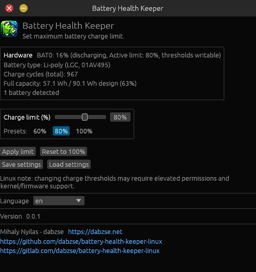
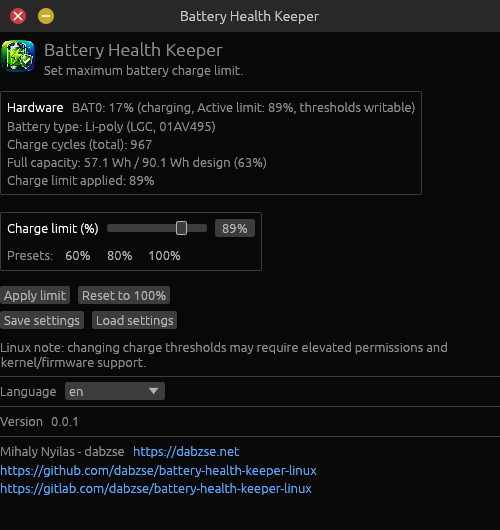

# Battery Health Keeper

A small Rust desktop application for configuring battery charge thresholds on Linux.

first start



change charge limit


changing



changed, using AC


The application allows you to set an upper battery charge limit (e.g. 80%) \
to prolong battery health when working plugged in. Once applied, the hardware \
stops charging when reaching the limit.

## Requirements

- Linux
- Rust and Cargo
- A battery driver exposing the charge threshold file:
  - `/sys/class/power_supply/<battery>/charge_control_end_threshold`
  - *(Optionally)* `/sys/class/power_supply/<battery>/charge_control_start_threshold`
- Permission to write those files, usually through a udev rule, \
a privileged service, or an appropriate system configuration.

Many laptops do not expose writable charge thresholds. \
In that case the app can still open, but it cannot control charging for that device.

## Build and Run

From the project directory:

```bash
cargo run --release
```

To compile without launching the window:

```bash
cargo check
```

## User Manual

### 1. Set charge limit

Adjust the **Charge limit (%)** slider or use one of the quick preset buttons:
(`60%`, `80%`, `100%`).

### 2. Apply limit

Click **Apply limit**.
The app immediately writes the limit to the battery's \
`charge_control_end_threshold` sysfs file.
If your system also exposes `charge_control_start_threshold`, \
the start threshold is safely adjusted so it does not exceed the upper threshold.

### 3. Reset to 100%

When you are preparing to travel or need full battery capacity, \
click **Reset to 100%** to restore full charging.

### 4. Refresh hardware information

Click **Refresh hardware** after connecting a battery or changing permissions. \
The hardware panel shows:

- the detected battery
- current capacity
- active hardware threshold limit
- and whether its thresholds appear writable.

### 5. Save and load settings

Click **Save settings** to write your preferred limit and language to \
 `battery-health-keeper.json` in the current working directory. \
 The app loads this file automatically when it starts.

Use **Load settings** to discard unsaved edits and reload from the file.

The settings file uses this JSON structure:

```json
{
    "language": "en",
    "charge_limit": 80
}
```

*Note: Legacy configuration files containing older `cycles`*
*configurations are automatically migrated to use the first active charge limit.*

## Important Behavior

The app does not physically force a battery to discharge while connected to AC power.
When the battery reaches the configured upper threshold, \
the laptop firmware and charging circuit switch to AC bypass power \
and stop charging the battery.

## Localization

UI strings are editable in `lang/en.lang` and `lang/hu.lang`.
The files use one `key=value` entry per line; lines beginning with `#` are comments.

To add another language, copy the English file and translate its values:

```bash
cp lang/en.lang lang/de.lang
```

Select that file when starting the app:

```bash
BATTERY_HEALTH_KEEPER_LANG=de cargo run --release
```

You can also change languages directly from the dropdown inside the application.

## Troubleshooting

### No battery detected

Check that the system exposes a battery:

```bash
ls /sys/class/power_supply
cat /sys/class/power_supply/*/type
```

The app only uses entries whose `type` is `Battery`.

### Battery is detected but read-only

Check for the threshold files:

```bash
ls -l /sys/class/power_supply/<battery>/charge_control_*threshold
```

If the files do not exist,
the laptop driver does not provide the interface used by this application.

If the files exist but cannot be written,
configure an appropriate udev rule or run the application
with the permissions required by your system.
Avoid making the entire sysfs tree globally writable.

For a quick diagnostic only,
you can test whether the current user can write the files:

```bash
printf '80' | sudo tee /sys/class/power_supply/<battery>/charge_control_end_threshold
```

If these commands return `Permission denied`,
configure access for the threshold files with your
distribution's udev or device-permission system.

## Tested on

- Fedora 44 (GNOME 50.4)
- Debian 13 (GNOME 50.3)

## License

Whatever.
